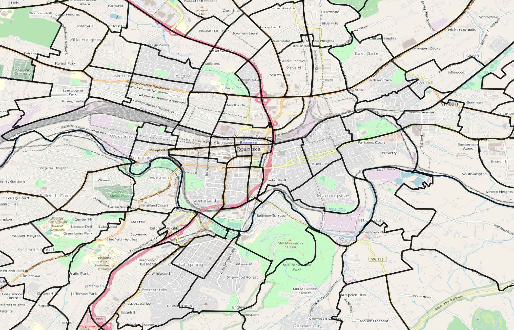
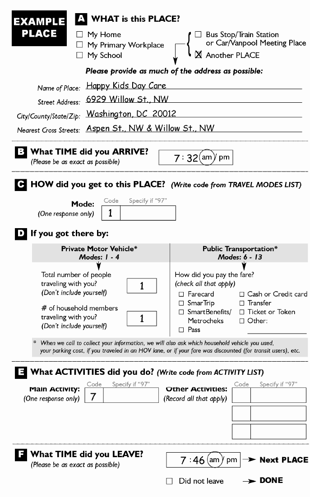

# Building Blocks {#chap-blocks}

```{r setup-blocks, include = FALSE}
knitr::opts_chunk$set(cache = TRUE)
library(tidyverse)
library(nhts2017)
theme_set(theme_bw())
```

This chapter contains concepts, definitions, and mathematical techniques that will
be used throughout the semester. Critical terms to understand are given in **bold**.

## Planning for Human Systems

If you look out on any sufficiently busy road, you will see a steady stream of
vehicles passing by. Each vehicle is largely indistinguishable from the others,
and it is easy as an engineer responsible for that road to see the cars driving
by as little more than an input to a problem. But the *people* inside the cars
should not be indistinguishable from each other. Each person who is driving or
riding in each of those cars has their own reasons to be driving on that road.
One person might be driving to work; one person might be trying to get home to
his or her family. Another car might hold a family going on vacation, or a group
of friends heading to a movie.

If you don't recognize that each person who travels is different, with different
needs and purposes, then it is easy to look only at the **supply** of transportation
infrastructure. Is the road wide enough? Is the traffic signal timed appropriately?
But as with anything in the economy transportation is a function of both supply 
and **demand**. Why are so many people trying to get down this one road *right now*?
Why didn't more people take transit? Why didn't some people choose a different
destination? Or why didn't some people just stay home in the first place? 

Transportation planning therefore must be concerned with both the supply of
infrastructure and the demand for travel. For the most part, economists consider
travel a **derived demand**, which means people only go to the hassle of 
travelling somewhere if they have some other reason to be there. No one 
typically just drives around (with the possible exception of teenagers on a
weekend night); they are going to work, or school, or a social engagement, or
*something*.

Travel demand has not been stable over time. The availability of inexpensive
automobiles in the 20th Century created demand for inter-city and intra-urban
roads that did not exist before. Rising labor force participation rates for
women radically changed the number and types of trips the average household
makes in an average day. Technological developments like teleconferencing and
smartphone-enabled ridehailing could generate different trends. At the same
time, populations in most regions continue to grow. **Planning** for future 
transportation infrastructure is difficult because of the uncertainty of the
future, but it is necessary to keep economies rolling and preseve or improve
quality of life.

In the United States and most societies with some democratic process,
**decisions** about what transportation facilities to build, which policies to
implement, and how to build a city generally fall to **decision makers**. These
decision makers consist of mayors, city councils, planning commissions, 
state legislatures, Congress, state and federal agencies, and innumerable others
who are elected by the public, or who are accountable to others who have been.
In making decisions about how to spend public money on civil infrastructure or
enact tax or other policies, decision makers consult **plans** developed by
professional engineers and planners.

As engineers and planners, we are rarely in a position to *make* decisions, but
we have a responsibility to provide accurate data and technical analysis to 
support decision makers. There is a misconception that transportation planners
must accurately predict the future to be relevant. The purpose of transportation
planning is not to perfectly envision what will happen under every scenario, 
it is to provide information that will help make good decisions now so that
the future is at least as pleasant as the present. We all have hopes for what
our lives and community will look like ten or twenty years from now; it may not
be possible for anyone to provide analysis entirely free of all personal bias.
But as you conduct your work as an engineer and planner, you owe the public your
integrity and competence as you provide information to their representatives.

## The Four-Step Transportation Planning Process

How can you know what might happen in the future? And how might that change based
on decisions that you make today? This basic question is at the heart of 
transportation planning:

  - What might traffic look like if we build nothing and population still grows?
  - Can we build less if we change land development patterns?
  - How many people will use this new transit line?
  
In many fields --- including politics, meteorology, economics, etc. ---
professionals who seek answers to questions like this do so with the help of a 
**model**. A model is a mathematical representation of a real-world system. 
In any model, there are things that need to vary (called inputs), things that
can be estimated or calibrated (called parameters), and results (called outputs). 
There are also things that are held fixed. The specific mathematical structure
of the model, and which things get included and which things are excluded or
abstracted away, determine what the model should and should not be used for.

For example, we might try to predict something with a linear model, 
\begin{equation}
  y = \alpha + \beta x + \varepsilon
  (\#eq:basic-model)
\end{equation}
In this case $y$ is the output, $x$ is the input, the 
$\beta$ parameter defines how the input influences the outcomes, $\alpha$ is a
fixed value, and $\varepsilon$ accounts for the random influence of all the 
factors we did not include. We could add more $\beta$ and $x$ terms to 
include more factors in the model. We could also change the mathematical format
of the model to represent different types of outcomes, or chain several smaller
models together to represent more complex relationships. If we wanted to see what 
might happen if $x$ changed, we could put in a new value into this equation 
and the output result $y$ might be a plausible prediction. The plausibility of
the output is a function of how well the mathematical model actually represents
the reality of the system.

In this class you will learn the details of the *travel demand modeling process*, 
which is a chain of many models, each with different inputs and outputs. A
travel demand model on the whole has two basic inputs:

 - Socioeconomic data representing where people live and work and go to school and
 do other things.
 - Transportation network data representing the roads and transit services and
 other methods people use to get between their activities.
 
The basic outputs of a travel demand model are transportation volumes and levels
of service. There are many ways to design and build travel demand models, but
the traditional way most regions in the United States approach travel demand models
is through a **four step**, trip-based^[The primary alternative to the four-step method is called an "activity-based" method. Activity-based models can be significantly more complex to construct and use, but they are based more concretely in human behavior. Whether they actually result in better decisions by transportation planning agencies is an open question.] process. The four steps are:

 1. Trip Generation
 2. Trip Distribution
 3. Mode Choice
 4. Route Assignment
 
A *trip generation* model determines how many trips are produced in each *zone*
(neighborhood), and how many trips are attracted to each zone. The inputs to
this model is the socioeconomic data in each zone. Mathematically, trip generation
can be represented as 
\begin{equation}
  P_i = f(SE_i), A_j = f(SE_j)
  (\#eq:tripgen)
\end{equation}
where $i$ and $j$ are the production and destination zone indexes.

A *trip distribution* model seeks to pair the productions and attractions in the
zones based on the travel costs $c$ between the two zones. Mathematically, trip
distribution can be represented as
\begin{equation}
  T_{ij} = f(P_i, A_j, c_{ij})
  (\#eq:tripdist)
\end{equation}

A *mode choice* model estimates how many of the trips from $i$ to $j$ will happen
on each available mode $k$, based on the travel time by each mode and other 
attributes of the origin and destination zones. Mathematically,
\begin{equation}
  T_{ijk} = f(T_{ij}, c_{ijk}, SE_{i,j}) 
  (\#eq:modechoice)
\end{equation}

A *route assignment* model determines the specific routes that the trips going
between $i$ and $j$ take. This allows us to estimate the volume of level of 
service on each highway link and transit system $l$. Mathematically,
\begin{equation}
  LOS_l, V_l = f(T_{ijk}, c_{ijk})
  (\#eq:modechoice)
\end{equation}

On the whole, the travel demand model can be represented mathematically as a 
single function where the output transportation volumes and levels of service
are a function of the input socioeconomic information and travel costs.

\begin{equation}
  LOS_l, V_l = \mathcal{F}(SE_{i,j}, c_{ij})
  (\#eq:tdm)
\end{equation}

The details of each of these models will be the topic for the next several 
chapters.

## Travel Model Building Blocks

In this section, we present some of the terms used in transportation planning
and modeling, as well as some of the data objects used in constructing travel
demand models.


### Travel Analysis Zones and SE Data

The "people" in a model conduct *activities*: work, school, recreation, and
other activities. Because travel is a derived demand, the purpose of travel is to 
move between these activities. So a travel model needs a way to represent where
the households, persons, jobs, and activities are located in space.

Activities in travel demand models happen in **Travel Analysis Zones** (TAZs). 
The model tries to represent trips between the TAZs. Because trips inside a
TAZ --- called intrazonal trips --- are not included in the travel model, each
TAZ should be sufficiently small such that these trips do not affect the models'
ability to forecast travel on roadways.  The following rules are helpful when
drawing TAZ's:

   - The TAZ should not stretch across major roadways
   - The TAZ should contain principally one land use, though in some areas this
   is not possible.
   - In areas with more dense population, the TAZ should be smaller.

Each TAZ is associated with **socioeconomic** (SE)  data, or information about
the people, businesses, and other activities that are located in the TAZ. 
**Households** are a basic unit of analysis in many economic and statistical
analyses. A household typically consists of one or more **persons** who reside
in the same dwelling. Individuals living in the same dwelling can make up a
family or other group of individuals; that is, a group of roommates is 
considered a household. Not everyone lives in households, however; some people 
live in what are called group quarters: military barracks, college dormitories,
monasteries, prisons, etc. Travel models need to handle these people as well, but
in this class we will focus on people who live in households.

Households in travel models are often grouped into a classification scheme
based on the number of people in the household, the number of children, the number
of vehicles, etc. Households of different classifications will have different
behavior in the rest of the model.

::::{.rmdthink}
Your lab activity for this unit will walk you through specifying a
household classification model.
::::

**Firms** are another basic unit of analysis in many economic and statistical
analyses. A firm is a profit-seeking person or entity that provides goods or
services in exchange for monetary transactions. A firm can provide raw resources,
manufactured resources, other services, or be a place of employment. In some
cases, a firm may be another household. Each firm will have an *industry* type. 
Examples of industry types include office, service, manufacturing, retail, etc.
In many SE data files, firms are simply represented as the total number of 
jobs in a TAZ belonging to each industry.  Other **Institutions** including
academic, government, and non-profit entities will also be represented in the SE
data in terms of their jobs.

It is important to be precise in our definitions when put all of these different
items into an analysis. A typical socioeconomic data table for a small region is
given in Table \@ref(tab:setable). Note the following relationships:

  - Persons live in Households
  - Workers are Persons who have a Job
  - Firms have employees who work at a Jobs 

```{r RoanokeTAZ, fig.cap="Travel Analysis Zones in Central Roanoke.", out.width='100%', echo = FALSE}

```

When we talk about "how many jobs" are in a TAZ, we mean "How many people do
the firms located in that TAZ employ," and not "how many people who live
in that TAZ are workers."

```{r setable, echo = FALSE}
se_nrow <- 3
tibble(
  taz = 1:se_nrow, persons = sample(30:50, se_nrow), 
  hh = round(persons * rnorm(se_nrow, 0.8, 0.3)),
  workers = round(persons * rnorm(se_nrow, 0.4, 0.1)),
  retail = sample(100:150, se_nrow), office = sample(50:100, se_nrow),
  manufacturing = c(2, 11, 0)
) %>% knitr::kable(caption = "Example SE Table")
```


::::{.rmdexample}
Alice lives with her husband in zone $A$ and works as an accountant in zone $B$.
Her husband does not currently work.
Fill out the SE table from Table \@ref(tab:setable) with *just* this 
household's information.

Two persons live in one household with one worker in zone A. The firm Alice works at 
has an office job for her in Zone B.

| taz | persons | hh         | workers | retail | office | manufacturing |
|-----|---------|------------|---------|--------|--------|---------------|
| A   |     2   |         1  |        1|        |        |               |
| B   |         |            |         |        |       1|               |

::::


### Transportation Networks 

The purpose of a travel model is to understand how people are likely to use
transportation infrastructure, so there has to be a way to represent 
roadway and transit systems. We do this with a 
*network*^[Sometimes called a *graph* in mathematics.]. A network consists of
two basic data structures: **Nodes** and **Links**

Nodes are points in space. In a highway network, almost all nodes represent 
intersections between different roads. Some important nodes represent the 
**TAZ Centroids**, or the points where the households and jobs in the travel
model are located.

Links connect nodes, and represent roads. Links have many different attributes
describing the characteristics of the roadway they represent. The two most 
important link attributes are the link's *speed* and *capacity*, because they
provide the travel costs ($c_{ij}$ above) to the various steps of the model. But
these attributes might not always be known at the outset, so instead we use
attributes of the roadway that influence capacity and speed, and then calculate 
these other values.

**Functional Type** or **Functional Class** describes the relative
role each road plays in the transportation system [@2018aashto]. Every street
fills a role on a spectrum from mobility on one end to accessibility on the other: 
roads that are good at moving high volumes of vehicles are usually not good at 
providing access to homes and businesses. Common functional types include:

  - *Freeways* are provided almost exclusively to enhance mobility for through traffic.
    Access to freeways is provided only at specific grade-separated interchanges,
    with no direct access to the freeway from adjacent land except by way of those 
    interchanges.
  - The primary function of major and minor *arterials* is to provide mobility of through 
    traffic. However, arterials also connect to both collectors and local roads and
    streets and many arterials provide direct access to adjacent development. 
  - Major and minor *collectors* connect arterials to local roads and provide access
    to adjacent development. Mobility for through traffic is less important. 
  - *Local streets* exist primarily to serve adjacent development. Mobility for 
    through traffic is not important, or even desired.
  
Figure \@ref(fig:udot_classes) shows roads in Provo and Orem classified by this
scheme. Streets of a functional class below collector are almost never included
in travel models, unless they provide essential connectivity between other
roads. Entire neighborhoods of local streets may be represented by just a
handful of special links called *centroid connectors*.

```{r udot_classes, fig.cap="UDOT Functional Classes.", out.width='100%', echo = FALSE}
knitr::include_graphics("images/UDOT_Functional_Classes.png")
```

::::{.rmdthink}
Why are local roads not included in travel models?
::::

**Free-flow speed** is the speed vehicles travel when the road is empty.
Historically, travel modelers would use formulas in the Highway Capacity Manual
to estimate the free-flow speed for roadways, or assert a basic calculation like
5 miles per hour over the speed limit. More recently, modelers use the speeds 
reported from GPS devices in the middle of the night to establish free-flow 
speeds.

The number of **lanes** on a road is fairly self-explanatory, but it plays a 
major role in the road's capacity.

Roads located in different **area types** -- urban, suburban, and rural -- 
operate differently from each other. Sometimes travel models will assert this 
value, but more recent models will calculate the area type for each link
based on the density of the surrounding TAZs. 

Link **capacity** is the maximum number of vehicles a can optimally transport
between two nodes.  The capacity is a function of functional type, lanes,
free-flow speed, area type, etc. Usually travel models will calculate the
capacity based on the given values for other roadway characteristics, but
sometimes there are ways to override this feature, i.e., if engineers have
developed specific capacity estimates for a new project.

**Centroid connectors** are special links that connect centroids to a network. 
These are different from other links in that they usually don't have a capacity
or a speed (they don't represent real roads).

### Matrices

Travel models need to represent travel times, costs, and flows between zones.
Models store this data in **matrices**, special data structures developed for 
this purpose. Each matrix is a square table where the rows $i$ represent origin
zones and the columns $j$ represent the destination zones. Each cell represents
something about the relationship between the two zones.

There are two kinds of information we typically
represent with matrices:

  - **Cost matrices**, or skims, are matrices where the cells contain estimates of
  travel time or cost. They are called *skims* because they are the results of
  *skimming* a network to find the shortest path between each pair of TAZ
  centroids.

  - **Flow matrices**, represent flows of people or vehicles from each origin to
  each destination. The number in the corresponding cell $T_{ij}$ is the total
  number of trips made, and represents the demand between two zones in a network.


## Household Travel Surveys and Population Data

Travel demand models try to represent individual behavior. How many trips
does the average household make per day? How do people respond to changes in 
transit fare? And how can a modeler know if the model accurately reflects 
total traffic?

Household travel surveys are a critical component of much travel modeling
practice and research, and are a primary way to answer some of these questions.
In a travel survey, a regional planning 
agency^[Like a Metropolitan Planning Organization (MPO).] will recruit households
to participate in the survey. Often there is some kind of reward to encourage
participation, like a gift card or raffle. Once recruited, household members
fill out a diary of their activities on an assigned day; Figure
\@ref(fig:travel-diary) shows an example of one activity from a survey diary.
From the example, you can see the kinds of data that are available: where the 
person traveled, which travel mode they used, and what was their reason for
making the trip.

```{r travel-diary, fig.cap="Example travel survey diary entry.", out.width='70%', echo = FALSE}

```

Not all travel surveys are filled in on forms; nowadays telephone interviews or
mobile applications are more common (more on that below). But for decades, paper
travel surveys were the basis of almost all transportation behavior science.

Once the surveys are collected, the data is usually processed into several tables
stored in different files or a database. 

  - A **Households** table has one row for each household in the dataset, including
  information about the number of people in the household, the number of vehicles,
  and the household income. 
  - A **Persons** table has one row for each person in the dataset --- including
  which household they are a part of (to link with the households table) --- and
  personal attributes like age, student or worker status. 
  - A **Vehicles** table has one row for each vehicle owned by the households in
  in the dataset, including attributes like model year, vehicle class, and fuel
  efficiency.
  - A **Trips** table has one row for each trip taken by each person in the dataset.
  This table can be linked against the other tables if necessary, and contains
  information like the trip purpose and many other elements collected with the form
  in Figure \@ref(fig:travel-diary).
  
Tables \@ref(tab:show-nhts-hh) through \@ref(tab:show-nhts-trips) show
data collected from one household in the 2017 National Household Travel Survey. 
The household contains four people, two of whom are working adults in their late 
thirties. (the other two are children, and the NHTS did not collect their trip
data). The household has two vehicles, and on the survey travel day person 2
appeared to make a few very long trips. It's impossible to know if this
is a typical day for this person or not, but that's the data that was collected.

```{r show-nhts-hh, echo = FALSE}
nhts_households %>% 
  mutate_at(c("hhfaminc"), ~as_factor(., levels = "labels")) %>%
  filter(houseid == "30000082") %>%
  select(houseid, hhsize, numadlt, wrkcount, hhvehcnt, hhfaminc, wthhfin) %>%
  knitr::kable(caption = "NHTS Households File")
```

```{r show-nhts-persons, echo = FALSE}
nhts_persons %>% 
  mutate_at(c("educ", "r_sex"), ~as_factor(., levels = "labels")) %>%
  filter(houseid == "30000082") %>%
  select(houseid, personid, r_age, educ, r_sex) %>%
  knitr::kable(caption = "NHTS Persons File")
```

```{r show-nhts-vehicles, echo = FALSE}
nhts_vehicles %>% 
  mutate_at(c("make", "model", "fueltype"), ~as_factor(., levels = "labels")) %>%
  filter(houseid == "30000082") %>%
  select(houseid, vehid, vehyear, make, model, fueltype, od_read) %>%
  knitr::kable(caption = "NHTS Vehicles File")
```

```{r show-nhts-trips, echo = FALSE}
nhts_trips %>% 
  mutate_at(c("trptrans", "trippurp"), ~as_factor(., levels = "labels")) %>%
  filter(houseid == "30000082") %>%
  select(houseid, personid, strttime, endtime, trpmiles, trptrans, trippurp) %>%
  knitr::kable(caption = "NHTS Trips File")
```

Note that that the households data in Table \@ref(tab:show-nhts-hh) contains a
numeric column called `wthhfin`. This is a survey *weight*. Because it is impossible
to sample everyone in a population, there needs to be a way to *expand* the survey
to the population. What this number means is that the selected household carries
the same *weight* in this survey as approximately 1100 households in the general
population. Also note that not every household's weight will be equal; because
some population groups have different survey response weights, some households
will need to be weighted more heavily so that the survey reflects the general 
population. Most software packages have functions that allow you to 
calculate statistics or estimate models including weighted values. The code 
chunk below shows how to calculate the average number of workers per household
with and without weights in R; as you can see, omitting the weights leads
to a substantial change in the survey analysis.

```{r weighted-mean, echo = TRUE}
# Average workers per household with no weights
mean(nhts_households$wrkcount)
# Average workers per household, weighted
weighted.mean(nhts_households$wrkcount, nhts_households$wthhfin)
```


Travel survey methodology is changing rapidly as a result of mobile devices with
location capabilities. First, most travel surveys are now administered through a
mobile application: respondents are invited to install an app on their smartphone
that tracks the respondent's position and occasionally asks questions about
trip purpose or mode. This makes collecting and cleaning data considerably easier
than traditional paper surveys, and it also lowers the response burden for the
survey participants.  Another change that mobile data has brought to travel surveys
is the introduction of large datasets of location information that planners can
purchase directly from cellular providers or third-party providers. Though these
data do not have all the information on demographics and preferences a survey 
would provide, they provide a considerably larger and more detailed sample 
on things like overall trip flows. As a result, it may be possible to collect
surveys less frequently, or to reduce survey sample sizes.


## Statistical and Mathematical Techniques

Many elements of travel modeling and forecasting require complex numerical and
quantitative techniques. In this section we will present some of these techniques.
Many of the data tables are in the `nhts2017` package. To install this package, 
follow the directions in the [Appendix](#app-rstudio).


### Continuous and Discrete Distributions

In general, statistical variables can fall into one of two categories:

  - *Continuous* variables can take any numeric value along some range
  - *Discrete* variables can take some limited set of predetermined values

A simplistic definition would be to say that continuous variables are numeric and
discrete variables are non-numeric. A continuous variable has statistics such as 
a *mean*, but these statistics do not make sense on discrete variables. In the
NHTS trips dataset, we can compute a mean trip miles, but we cannot compute
a mean trip purpose. Or we can't compute a mean that makes sense.

```{r dc_mean, echo = TRUE, error=TRUE}
# mean of continuous variable: trip length
weighted.mean(nhts_trips$trpmiles, nhts_trips$wttrdfin)
# mean of categorical variable: trip purpose
weighted.mean(nhts_trips$trippurp, nhts_trips$wttrdfin)
```

What we can do, however, is we can print a summary table showing the number
of observations that fit in each trip purpose category. Note that sometimes there
will be a category devoted to data that is missing or otherwise invalid.

```{r dc_categories, echo = TRUE}
table(nhts_trips$trippurp)
```

Sometimes it is handy to split a continuous variable into categories so that you 
can treat it as a discrete variable.

```{r dc-cut, echo = TRUE}
nhts_trips$miles_cat <- cut(nhts_trips$trpmiles, breaks = c(0, 10, 20, 30, 50, 100, Inf))
table(nhts_trips$miles_cat)
```


When we visualize the distribution of a continuous variable, we might
use a histogram or density plot, but with a discrete variable we would use 
a bar chart.

```{r dc-histogram, echo = TRUE, fig.cap="Visualizing a continuous distribution with a histogram.", warning=FALSE}
ggplot(nhts_trips, aes(x = trpmiles, weight = wttrdfin)) +
  geom_histogram() + xlab("Trip Distance [Miles]") + ylab("Weighted Trips") +
  scale_x_continuous(limits = c(0, 50))
```

```{r dc-barchart, echo = TRUE, fig.cap="Visualizing a discrete distribution with a bar chart.", warning=FALSE}
ggplot(nhts_trips, aes(x = as_factor(trippurp, levels = "labels"), 
                       weight = wttrdfin)) +
  geom_bar() + xlab("Trip Purpose") + ylab("Weighted Trips") 
```


To this point we've only looked at the distribution of one variable at a time.
There are lots of cases where someone might want to consider the *joint* 
distribution of two variables. This joint distribution tells you what is happening
with one variable while the other variable changes. In a table like the one below,
the margins of the table (the row and column sums) contain the single variable
distribution. So sometimes we call these the *marginal* distributions.

```{r dc-joint}
table(nhts_trips$miles_cat, nhts_trips$trippurp)
```

We can visualize joint distributions as well, and sometimes the results are
quite nice.

```{r dc-joint-hist, echo = FALSE, warning = FALSE}
ggplot(nhts_trips %>% 
         mutate(trippurp =as_factor(trippurp, levels = "labels")) %>%
         filter(trippurp != "Not ascertained"), 
         aes(fill = trippurp, x = trpmiles, weight = wttrdfin)) +
  geom_density(alpha = 0.5) + 
  xlab("Trip Distance [log miles]") +  ylab("Density of Trips") +
  scale_color_discrete("Trip Purpose") + scale_x_log10(limits = c(0.1, 100)) 
```


### Iterative Proportional Fitting {#ipf}

Iterative Proportional Fitting

### Regression Analysis

We often want to know what will happen 

```{r}

```


### Numerical Optimization

Let's say you have a function with a 

## Homework {-#hw-blocks}

> Some of these questions require a completed run of the demonstration model.
For instructions on accessing and running the model, see the [Appendix](#app-demomodel)

1. How does recreational transportation --- i.e., going for a bike ride --- fit into the
theory of derived demand for travel? Write a short paragraph explaining your thoughts
based on what we covered in lecture and the text.

1. Think about a recent transportation-related construction project you have
seen in your community. Find an article in a local newspaper discussing the project.
Why was the project built (or why is it being built)? Who supports the project?
Does anyone oppose the project? Write a short paragraph including a link and 
citation to the article.

1. Download the [rmove](https://rmove.rsginc.com/) mobile application, and log 
in with the password given you by the instructor. Track your daily activies and
trips for *three days*. You may include at most one weekend day. Write a short
summary of your activities, including:

    - How many trips you took each day
    - The mode split of all your trips

1. With the TAZ layer and socioeconomic data in the demonstration model, make a
set of choropleth maps showing: total households; household density; total jobs;
job density; density of manufacturing vs office vs retail employment. Compare
your maps with aerial imagery from Google Maps or OpenStreetMap. Describe the
spatial patterns of the socioeconomic data in the model region. Identify which
zones constitute the central business district, and identify any outlying
employment centers.

1. With the highway network layer in the demonstration model, create maps
showing: link functional type; link free flow speed; and link hourly capacity.
Compare your maps with aerial imagery from Google Maps or OpenStreetMap.
Identify the major freeways and principal arterials in the model region. *Note*:
you will need to run the demonstration model through the network setup step to
calculate the capacities and append them to the link.
   
1. Find the shortest free-flow speed path along the network between two zones.
Find the shortest distance path between the same two zones. Are the paths the
same? Do the paths match what an online mapping service shows for a trip in the
middle of the night?

1. Open the highway assignment report, which shows vehicle hours and miles
traveled by facility type. What percent of the region's VMT occurs on freeways?
What percent of the region's lane-miles are freeways? 

1. Open the output highway network. Create a map of the 
highway links showing PM period level of service based on the volume to capacity
ratios in the table below. How would you characterize traffic in Roanoke? Which
is the worst-performing major facility?


