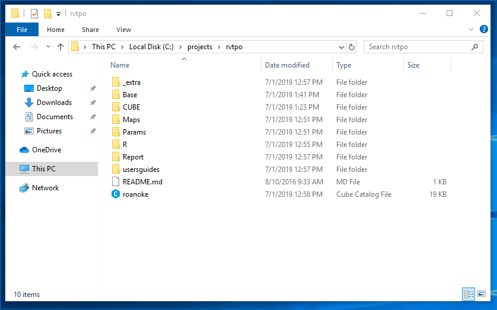
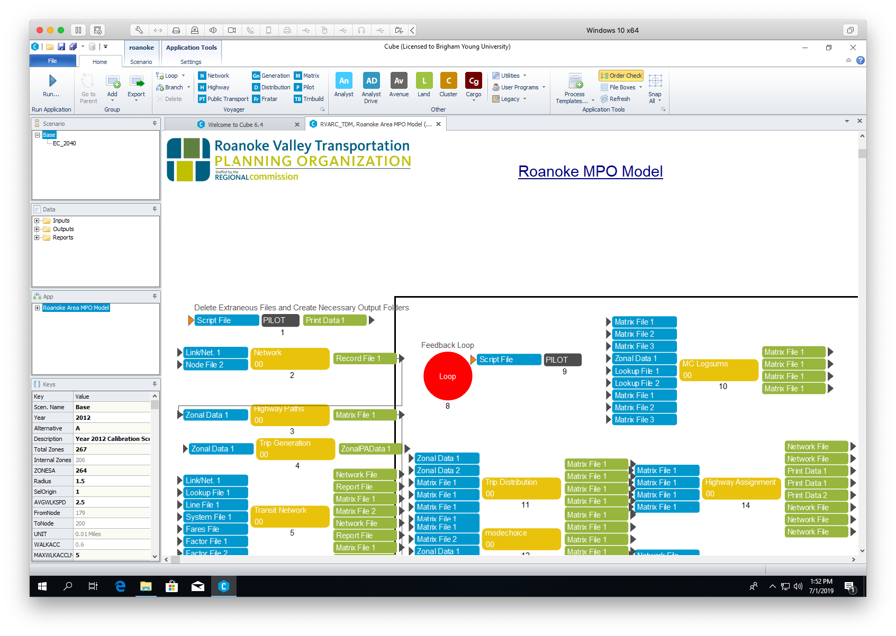

# (APPENDIX) Appendix {-} 

# Demonstration Model {#app-demomodel}

In this class we will use the model for the Roanoke Valley Transportation
Planning Organization (RVTPO), the MPO responsible for transportation planning 
in Roanoke, Virginia. The model is written for the CUBE travel modeling software
package, the same software used by the Wasatch Front Regional Council model. The
model code and files are available on 
[Box](https://byu.box.com/s/34xeaghgt8lpbcraosb7cbt8umddh96x).

A few key parameters files have been reset to default values, rather than the
calibrated values used in the actual model. The homework assignments and lab
activities in this course will walk you through re-calibrating the model to use
in your term assignments.

## Running the Model

The model files are available from [Box](https://byu.box.com/s/34xeaghgt8lpbcraosb7cbt8umddh96x) 
as a compressed file called `rvtpo_bare.zip`. Extract this file to a folder on 
your local computer. I prefer to keep my models in a
folder on the `C:\` drive called `C:\projects`. It may be that the C drive is
not available to you, but you should place the model at a path that makes sense
and that will not change from session to session. It is possible that the `J:`
drive will not have enough space for multiple runs of the model.

> The path that you choose **must have no spaces**, from the drive letter to the 
final folder, i.e., `C:\folder\folder\rvtpo_bare`. If there are any spaces your 
model will crash.



You'll explore more of these files in the future, including later in this
assignment. Double-click on the `roanoke.cat` Cube catalog file. This will open
the model application interface in Cube. On this interface you can see the steps
the model will execute, as well as access the input / output files for each
step. Some steps actually contain several sub-steps, and double-clicking the
yellow step box will expand that application.



Run the base scenario of the model by pushing the large blue "Run"
button in the upper left-hand corner of the Cube application. A window 
will appear first asking you to confirm which scenario you are running, and then
showing you the progress. This model takes approximately 15 minutes to run on my
laptop.^[It's a small model with only about 250 zones; a larger model like WFRC
will take many hours. Generally model run time increases with the square of the
zones.] Complete instructions are included in the model user's guide (in the
`usersguide/` folder). 

I have also made a YouTube video showing how to do this. Note that the video
shows you getting the model from Canvas; get it from [Box](https://byu.box.com/s/34xeaghgt8lpbcraosb7cbt8umddh96x).

```{r initial-run-video, echo = FALSE}
knitr::include_url("https://www.youtube.com/embed/88HAaQLVpJk")
```


## Files and Reports

## Cube Tips and Tricks

### Shortest Paths

### Working with Matrices

### Writing Custom Scripts


