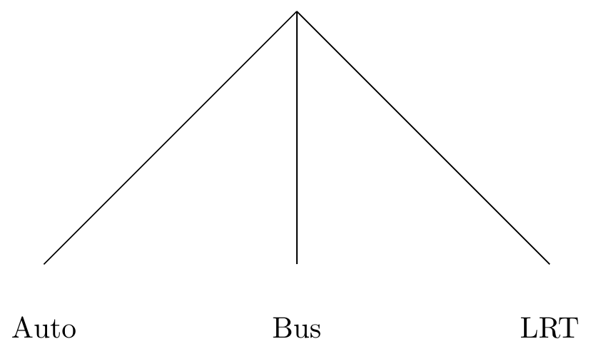
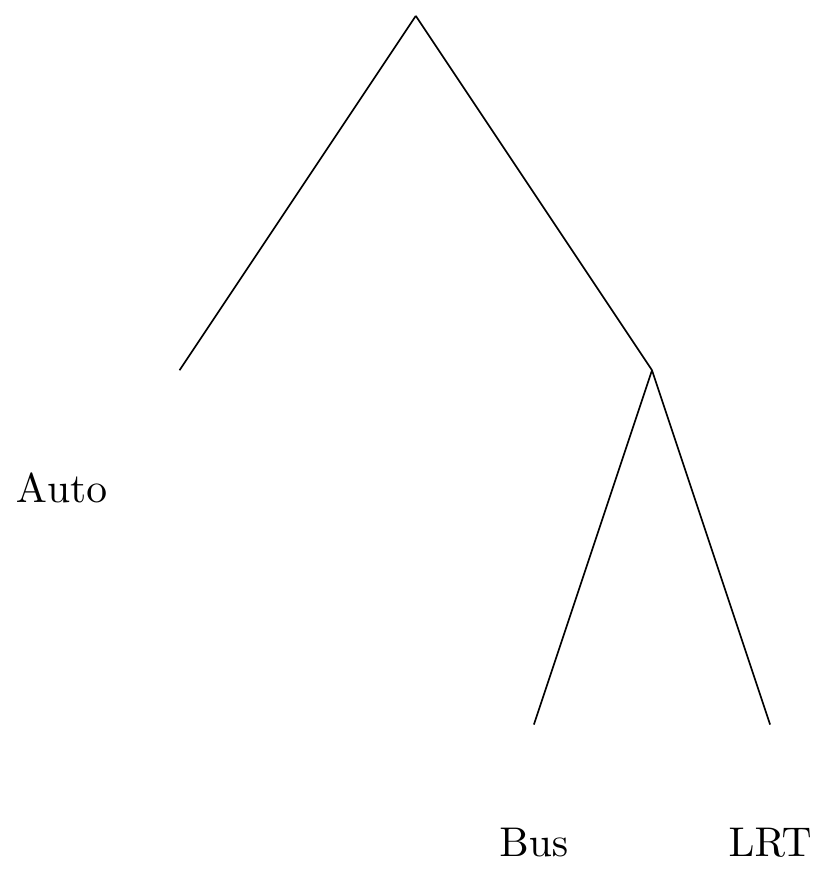

# Mode and Destination Choice {#chap-modechoice}


Assume that person has a set of mode choices in front of them. They could
pick to drive, walk, take transit, or some combination of those. Which one they
pick for which kind of trip is not a simple question, but travel models need
a mathematical way to represent this choice.

## Mathematical Derivation
We'll say that person $n$ is choosing between alternatives $i, j, \ldots \in J$.
In economic theory, people pick the alternative that brings them the most 
*utility*, $U$. So person $n$ will choose $i$ if $U_i>U_j, \forall j \neq i \in J$.
The problem we face is that $U$ contains things we can measure and model (like the 
travel time and the fare) as well as things we can't (like how much this person
hates riding the bus). So really $U_i$ has two parts: a measurable portion $V_i$
and an unmeasurable portion $\varepsilon_i$.

\begin{equation}
  U_i = V_i + \varepsilon_i
  (\#eq:uve)
\end{equation}

So in our model, people will choose $i$ if 

\begin{align*}
V_i + \varepsilon_i &> V_j + \varepsilon_j, \forall j \neq i \in J\\
V_i - V_j &> \varepsilon_j - \varepsilon_i, \forall j \neq i \in J\\
\end{align*}

or, if the difference in observed utility is greater than the difference in the
unobserved error. Because this difference in error is unobserved, we can treat
it as a random variable with an assumed distribution. If we make a particular
assumption^[Specifically, that $\varepsilon_i$ is distributed IID with a Gumbel extreme value distribution], then the *probability* that person $n$ chooses option $i$ is

\begin{equation}
  P_n(i | V_i, V_j \forall j \neq i \in J) = \frac{e^{V_i}}{\sum_{j\in J} e^{V_j}}
  (\#eq:mnl)
\end{equation}

There are two important things to note that result from this derivation:

  1. Only the differences in Utility matter. This will have a number of implications
  for the interpretation and use of the model.
  2. The model formula depends entirely on the assumed distribution of the unobserved
  utility. If that assumption isn't met (and it usually isn't!) a different model
  is needed.
  
## Utility Equations

The observed utility usually takes a linear form, $V_i = \alpha_i + X_i\beta$. This
means that each alternative will have a linear equation,

\begin{align*}
V_{\text{Auto}}  =&  - 0.05(\text{time}_a)  - 0.3(\text{cost}_a)\\
V_{\text{Bus}}  =& -4.5 - 0.05(\text{time}_b)  - 0.3(\text{cost}_b) - 1.4(\text{high income})\\   
V_{\text{Walk}}  =& -6.0 - 0.05(\text{time}_w)  - 0.3(\text{cost}_w) - 1.8(\text{high income})\\   
\end{align*}

Recall that only the difference in the utility matters, which we showed theoretically above.
you can also see it numerically because $e^0 / (e^1 + e^0) = e^1 / (e^2 + e^1) = 0.269$.
So the utility equations have to reflect this difference in the way that they get
structured. There are three basic basic values that show up in these equations,
and the difference between them is how they create and use difference in the
utility:

  - *Alternative-Specific Constants*: These function like intercepts in a 
  linear regression model. The constants control for the observed difference
  between alternatives resulting from the unobserved utility; if all else is
  equal, the constants describe what the utility of each mode will be. One
  alternative is selected as the *reference alternative*, with $\alpha = 0$.
  - *Generic Coefficients*: These coefficients have a single estimated
	parameter. That is, the $\hat{\beta}$ coefficient for these variables has the
	same value in the utility equation for every alternative. These estimates come
	from variables that vary naturally across the alternatives, like the cost of
	travel.
  - *Alternative-Specific Coefficient*: This type of coefficient has a unique
	estimate for each alternative. That is, $\hat{\beta}_{DA}$ is different from
	$\hat{\beta}_{Walk}$.  This type of estimate comes from variables that are
	constant across alternatives, like the distance of the trip.


## MNL Estimation

Ordinary Least Squares does not work on multinomial logit models, so we need
another way of estimating the model coefficients. We instead use a numerical
procedure called *maximum likelihood estimation*.^[You can estimate linear
regression models with maximum likelihood estimation as well, but it can be
proven the MLE and OLS result in exactly the same answers.]

The utility equation is $V_i = \alpha_i + X_i\beta$. We want to find an estimate
$\hat\beta$ that are *most likely* given the observed data. For one person,
the probability that our model picks an alternative $i$ is given by the MNL 
formula in Equation \@ref(eq:mnl). Let's simplify this to a function of $\beta$,
$P_{in}(\beta)$. We want to pick the value of $\beta$ that gives a high probability
to the chosen alternative and low probability to the non-chosen alternatives.
Let's create a power value $\delta_{in}$ equal to 1 if chosen and zero if not.
The likelihood of our model for one alternative is therefore

\begin{equation}
\mathcal{L} = P_{in}(\beta)^{\delta_{in}}
  (\#eq:likelihood)
\end{equation}

But we want to find values that maximize this likelihood for *all* alternatives 
for *all* people. Recall from basic statistics that the probability of multiple
independent events occuring simultaneously is the product of the probabilities
of each event. So the likelihood equation for our entire dataset is 

\begin{equation*}
\mathcal{L} = \prod_{n=1}^N \prod_{i \in J} P_{in}(\beta)^{\delta_{in}}
\end{equation*}

We encounter a problem here where each $P_{in}$ is going to be a number much
smaller than 1. If we multiply too many of these numbers together, our computer
won't be able to keep track of a number that small. So we instead use the
logarithm of the likelihood function which turns products into sums,

\begin{equation}
\log(\mathcal{L}) = \sum_{n=1}^N \sum_{i \in J} \delta_{in} \log(P_{in}(\beta))
  (\#eq:loglikelihood)
\end{equation}

We can also compare the log-likelihood of our estimated model 
$\log\mathcal{L}(\beta)$ against the log-likelihood of some reference models to create 
a statistic that works *kind of* like $R^2$ in a linear regression model.

First, imagine that we have a perfect model. That would mean the $P_{in} = 1$ for
the chosen alternative and zero for the others. The log-likelihood of this model
is

\begin{align*}
\log\mathcal{L}(*) &= \sum_{n=1}^N  \log(1)\\
   &= \sum_{n=1}^N  0\\
\end{align*}

Now, what happens if we have a model that is literally no better than random
chance? This could be called a *null model* where each option has equal probability.
That would also imply that every utility value is exactly the same,

\begin{align*}
\log\mathcal{L}(0) &= \sum_{n=1}^N \sum_{i \in J} \delta_{in} \log(\frac{e^0}{\sum_J e^0})\\
 &= \sum_{n=1}^N  \log(\frac{1}{J})\\
 &= N \log(\frac{1}{J})\\
\end{align*}

This value depends on the number of observations and alternatives in the data
set, and so will be different for each problem. But because the logarithm of
a fraction is a negative number, $\log\mathcal{L}(0)$ will be a large negative
number.

The last special likelihood is what would happen if we just used the observed
choice probabilities, or the *market shares*. This is equivalent to a model
estimated with only the constants and no other variables included.

\begin{align*}
\log\mathcal{L}(C) &= \sum_{n=1}^N \sum_{i \in J} \delta_{in} \log(\frac{e^\alpha}{\sum_J e^\alpha})\\
 &= \sum_{n=1}^N  \sum_{i \in J} \log(P_i)\\
 &= N_i \sum_{i \in J} \log(P_i)\\
\end{align*}

We can create a measure of goodness-of-fit using these measures. Let's call it
$\rho^2$. Let's consider how much more likely our estimated model is than the null
model:

\begin{equation}
  \rho_0^2 = 1 - \frac{\log\mathcal{L}(\beta)}{\log\mathcal{L}(0)}
  (\#eq:rhonull)
\end{equation}

If our model is no better than random chance, then $\rho_0^2 = 0$. If our model
is perfect (log-likelihood of zero), then $\rho_0^2 = 1$. In practice, you will 
not ever see $\rho_0^2$ values anywhere near 1. You can build an analogous
$\rho_C^2$ metric by using the market shares likelihood as a reference.

## IIA and Nested Logit

The MNL model has a property referred to as the 
**independence of irrelevant  alternatives** (IIA). This simply means that the
ratio of the probabilities of two alternatives is only based on the utility of
those two alternatives. Mathematically,

\begin{equation}
 \frac{P_i}{P_k} = 
   \frac{e^{V_i}}{\sum_{j\in J} e^{V_j}} \times 
   \frac{\sum_{j\in J} e^{V_j}}{} = \frac{e^{V_i}}{e^{V_k}}
  (\#eq:iia)
\end{equation}

This property plays an important role in mode choice, because it introduces 
some unreasonable behavior when we add a new mode. Consider if we have two 
modes, car and bus, with utilities of $V_{bus} = 0$ and $V_{car} = 1$. The
choice probabilities of these two modes are

\begin{align*}
  P_{car} &= \frac{exp(1)}{exp(0) + exp(1)} &= 0.731\\
  P_{bus} &= \frac{exp(0)}{exp(0) + exp(1)} &= 0.269\\
  \frac{P_{car} }{P_{bus}} &= 0.368  &
\end{align*}  

Now imagine add a light rail alternative to this scenario, with $V_{LRT} = 0.5$.
The choice probabilities are now

\begin{align*}
  P_{car} &= \frac{exp(1)  }{exp(0) + exp(1) + exp(0.5)} &= 0.506\\
  P_{bus} &= \frac{exp(0)  }{exp(0) + exp(1) + exp(0.5)} &= 0.186\\
  P_{LRT} &= \frac{exp(0.5)}{exp(0) + exp(1) + exp(0.5)} &= 0.307\\
  \frac{P_{car} }{P_{bus}} & = 0.368 &
\end{align*}  

The *ratio* of the choice probabilities of car and bus stay exactly the same. 
A consequence of this is that 73% of the new light rail passengers were
formerly automobile passengers. But this doesn't makes intuitive sense; we would
expect light rail and bus to have more unobserved things in common. Surely, 
some automobile riders will decide to take transit when there is a light rail
instead of just a bus, but not *most* of the new light rail riders to be
converts. So we need a way to represent the fact that some alternatives are
"closer" to other alternatives. 

When we derived the MNL, we assumed that the unobserved error $\varepsilon_i$
was distributed independently. That is, if we were to make a matrix of the
correlation of the error between our three alternatives for car, bus, and LRT,
it would be the matrix below:

\begin{equation*}
\varepsilon  \sim
\begin{matrix}
1 & 0 & 0\\
0 & 1 & 0\\
0 & 0 & 1\\
\end{matrix}

\end{equation*}

But what is more likely is that the two alternatives for bus and LRT have correlated
error terms, or the correlation between them is somewhere between 0 and 1.  Let's
assume that there is instead some coefficient that dictates the degree to which
these error terms are allowed to be correlated.

\begin{equation*}
\varepsilon  \sim
\begin{matrix}
1 & 0 & 0\\
0 & 1 & \lambda_{transit}\\
0 & 1 - \lambda_{transit} & 1\\
\end{matrix}
\end{equation*}

This is equivalent to saying that the choice of mode doesn't look like an
equal choice among three alternatives,



But instead a two-stage choice, where people first choose whether they will take
transit, and then which transit mode they will choose. 



This results in a **nested logit model**. The choice probability of an alternative
in this model is now

\begin{equation}
  P_{i} = \frac{e^{V_i/\lambda_k}(\lambda_{j \in B_{k}} e^{V_j/\lambda_k})^{\lambda_l - 1}}
  {\sum_{l\in K}(\sum_{j \in B_l} e^{V_j/\lambda_l})^{\lambda_l - 1}}
  (\#eq:nestedlogit)
\end{equation}

It is important to note that if the estimated $\lambda$ value equals one, then
there is no observable correlation between the error terms, and the model reduces
to the MNL. If $\lambda>1$, then it implies *negative* correlation between the 
alternatives. This violates utility theory, because it would cause *more* 
people to choose auto when the utility of a transit mode increases. So valid
values for the estimated correlation are $0 < \lambda < 1$.

## Accessibility and Log Sums

## Destination Choice


## Homework {-#hw-modechoice}

In this unit's assignment, you will use data from the 2000 Bay Area Travel
Survey to estimate multinomial  and nested logit models that predict mode choice for work
trips. The data is available on [on Box](https://byu.box.com/shared/static/ftzy74uaug0voet2wvwhgicxamhgcvp7.rds). The data
are named as `worktrips_dfidx.rds`. You will also need to load the 
`mlogit` library package, which contains the tools necessary to estimate
multinomial logit models.


```r
library(mlogit)
worktrips <- read_rds("data/worktrips_dfidx.rds")
```

Because multinomial logit models are so different from other models, 
the data are stored in a special type of data frame. You can see the first several
rows of this data below; Person 1 in household 2 has five alternatives, and they
chose to drive alone. Person 3 chose to take transit.


```r
head(worktrips[,1:8], n=12)
```

```
##                  HHID PERID CASE       ALTNUM NUMALTS CHOSEN  IVTT OVTT
## 2-1. Drive Alone    2     1    1  Drive Alone       5   TRUE 13.38  2.0
## 2-1. Share 2        2     1    1      Share 2       5  FALSE 18.38  2.0
## 2-1. Share 3+       2     1    1     Share 3+       5  FALSE 20.38  2.0
## 2-1. Transit        2     1    1      Transit       5  FALSE 25.90 15.2
## 2-1. Bike           2     1    1         Bike       5  FALSE 40.50  2.0
## 3-1. Drive Alone    3     1    2  Drive Alone       5  FALSE 29.92 10.0
## 3-1. Share 2        3     1    2      Share 2       5  FALSE 34.92 10.0
## 3-1. Share 3+       3     1    2     Share 3+       5  FALSE 21.92 10.0
## 3-1. Transit        3     1    2      Transit       5   TRUE 22.96 14.2
## 3-1. Bike           3     1    2         Bike       5  FALSE 58.95 10.0
## 5-1. Drive Alone    5     1    3  Drive Alone       4   TRUE  8.60  6.0
## 5-1. Share 2        5     1    3      Share 2       4  FALSE 13.60  6.0
```

In the first section, you will estimate a multinomial logit mode choice model
for work trips using the data collected in the San Francisco Bay. Then, you will
calculate nested logit models on the same data set. In the third step, you will
calculate mode choice model log sums and estimate a destination choice model.

### First Problem Set: Multinomial Logit Model Estimation {-}
To do this, use the `mlogit()` function, in a manner sort of like you
would use the `lm()` command. One thing to look out for: the difference between
generic and alternative-specific variables, described above. 
To specify the model, we use the following construction.


```r
fit.mnl <- mlogit ( CHOSEN ~ Generic | Alt.Specific, data = worktrips )
```

To examine the model output, the standard `summary()` command will produce a
coefficients table and key test statistics. The `modelsummary` 
packages will produce convenient model comparison tables that can be included in
a report or pasted into Excel for further formatting. For your homework, please
include a formatted model comparison table rather than a print out of each model
summary.

Question 1: Calculate the likelihood of a model with no covariates
(equal-shares) and a model with constants only (market shares). Estimate a model
with only the travel time, and calculate the $\rho^2$ statistics
with respect to the equal shares model and the market shares model. Which
statistic is reported by the `summary()` command? Why is this important?

Question 2: Estimate a model with just the total travel time
(`TVTT`) and the cost of the trip (`COST`). These two parameter estimates will
allow you to calculate the value of time for the sample population as 

$$VOT = \frac{60\hat{\beta}_{TVTT}}{100 \hat{\beta}_{COST}}$$ 

Report the value of time you calculate. Is this reasonable?

Question 3: Estimate a model with the out-of-vehicle travel
time (`OVTT`), and the in-vehicle travel time (`IVTT`). What is the
ratio of these parameters? What does this tell you about how people feel waiting
for the bus?

Question 4: Estimate a model with the residential population density
(`RSPOPDEN`) and the workplace employment density (`WKEMPDEN`), controlling for
the affordability of the trip (`COSTINC`). Does land use at the production or the
attraction end of the trip affect the mode choice problem more? Is it different
by mode?

### Second Problem Set: Nested Logit Models {-}

In this set of problems, you will estimate nested logit models. To specify
nests in an `mlogit` estimation, you supply a list of alternatives to the `nests` 
argument. The code below puts all auto-based alternatives in one nest called
`auto` and the other alternatives into another nest called `nonauto`.


```r
nl <- mlogit(CHOSEN ~ COST + TVTT  + OVTT | WKEMPDEN,  data = worktrips,
             nests = list(auto = c('Drive Alone', 'Share 2', 'Share 3+'),
                          nonauto = c('Bike', 'Walk', 'Transit'))
```


Question 5: Estimate a nested logit model including cost, travel time,
out-of-vehicle travel time, and workplace employment density. Group car
alternatives into one nest, and non-car alternatives into another. Constrain the
nesting parameter to a single value (set the parameter `un.nest.el = TRUE`).
What is the estimated value of the nesting parameter? What are the implications
of this parameter value for across-nest substitution?

Question 6: Estimate another nested logit model with the same nests, but this
time segment the data on income; include households making less than \$50k/year
in one segment and households making at least \$50k in the other. Add vehicles 
per worker as a covariate (`VEHBYWRK`). Comment on how the two segments respond
to the different covariates. Which matters more to which group?

Question 7. Of all the models you estimated (including in the previous segment),
which is the preferred in terms of model likelihood? What about in terms of
behavioral sensitivity / reasonableness?


### Third Problem Set: Log Sums and Destination Choice {-}


|                        |Mode Choice  |
|:-----------------------|:---------|
|(Intercept) × Share 2   |-2.405    |
|                        |(0.063)   |
|(Intercept) × Share 3++ |-3.863    |
|                        |(0.107)   |
|(Intercept) × Transit   |-1.535    |
|                        |(0.134)   |
|(Intercept) × Bike      |-3.595    |
|                        |(0.187)   |
|(Intercept) × Walk      |-2.598    |
|                        |(0.105)   |
|IVTT                    |-0.006    |
|                        |(0.006)   |
|OVTT                    |-0.052    |
|                        |(0.006)   |
|COST                    |-0.003    |
|                        |(0.000)   |
|WKEMPDEN × Share 2      |0.001     |
|                        |(0.000)   |
|WKEMPDEN × Share 3++    |0.002     |
|                        |(0.000)   |
|WKEMPDEN × Transit      |0.003     |
|                        |(0.000)   |
|WKEMPDEN × Bike         |0.001     |
|                        |(0.001)   |
|WKEMPDEN × Walk         |0.002     |
|                        |(0.001)   |
|Num.Obs.                |5029      |
|AIC                     |7329.0    |
|BIC                     |          |
|Log.Lik.                |-3651.489 |
|rho2                    |0.248     |
|rho20                   |0.595     |

Question 8. An MNL mode choice model is given above. Calculate the utility,
choice probabilities, and the choice model logsum for the individual in the
dataset below.

|  IVTT | OVTT |  COST | WKEMPDEN  | alternative |
|------:|-----:|------:|----------:|:------------|
|  13.4 | 2    |  70.6 |     3.48  | Drive Alone |
|  18.4 | 2    |  35.3 |     3.48  | Share 2     |
|  20.4 | 2    |  20.2 |     3.48  | Share 3+    |
|  25.9 | 15.2 | 116.  |     3.48  | Transit     |
|  40.5 | 2    |   0   |     3.48  | Bike        |


Question 9 The same person is choosing which of two destinations to travel to.
The travel times to Zone 1 are given in question 8, and the travel times to Zone
2 are given below. The destination choice utility equation is 
$V_j = 0.35 * \text{MCLS}_{ij} + 2.56 * \text{office}_j +  1.45 * \text{service}_j$.

|  IVTT| OVTT|   COST| WKEMPDEN|alternative |
|-----:|----:|------:|--------:|:-----------|
| 29.92| 10.0| 390.81|   764.19|Drive Alone |
| 34.92| 10.0| 195.40|   764.19|Share 2     |
| 21.92| 10.0|  97.97|   764.19|Share 3+    |
| 22.96| 14.2| 185.00|   764.19|Transit     |
| 58.95| 10.0|   0.00|   764.19|Bike        |

The socioeconomic data for both zones is given below.  Calculate the destination
utilities, choice probabilities, and the destination choice logsum.

| TAZ| office| service|
|---:|------:|-------:|
|   1|    126|     742|
|   2|    321|     140|

Question 10. An improvement to the transit system is proposed that will lower the
above individual's transit out-of-vehicle time to zone 1 to 5 minutes (from 15.2). Calculate
the mode choice utility, probabilities, and the mode choice model logsum. What
is the monetary value of this transit improvement to the mode choice of this person?

Question 11. Using the same improvement, calculate the destination choice utility,
probabilities, and destination choice logsum. What is the monetary value of the transit
improvement to the destination choice? Does this include the mode choice benefit?


## Lab {-}

In practice, small-sample surveys have a difficult time generating estimates of
choice parameters that are both precise and rational. As a result, it is
common to assert choice coefficients that have worked well in comparable
cities and then calibrate the mode-specific constants and distance decay
parameters to match your targets. In this lab you will calibrate the mode choice
models and the destination choice models for the following trip purposes:

  - Home-based Work
  - Home-based Other
  - Home-based Shopping
  
In the Roanoke mode choice model, HBO and HBShopping get combined for mode choice. 
So you will calibrate three purposes in the destination choice model, but only
two in the mode choice model.

Even though trip distribution comes first in the standard four-step process, we 
end up using the mode choice logsums mode choice to inform destination choice. 
Mathematically they happen simultaneously, but in the model it goes 

```
skims > mode choice logsums > destination choice > mode choice
```

As a result you will need to calibrate the models iteratively: first adjust the 
mode choice constants, then the distance decay parameters, then mode choice,
etc., until you are satisfied that the model meets the targets.

### Mode Choice Calibration {-}

The coefficients are found in the `./Params/mc/MC_Coefficients.csv` file. Record
the coefficients in a table in your lab report accompanying a description of the
purpose of each coefficient and any notable values. These coefficients are
fixed; they should not change as part of this exercise.


```r
read_csv("data/rvtpo_data/MC_Coefficients.csv") %>%
  pander::pander()
```

```
## Parsed with column specification:
## cols(
##   `;N` = col_double(),
##   Name = col_character(),
##   HBW = col_double(),
##   HBO = col_double(),
##   NHB = col_double(),
##   HBSC = col_double()
## )
```


------------------------------------------------------------
 ;N     Name        HBW        HBO        NHB        HBSC   
---- ----------- ---------- ---------- ---------- ----------
 1      CIVTT      -0.025     -0.015     -0.02      -0.015  

 2     CSWAIT     -0.05625   -0.03375    -0.045    -0.03375 

 3     CLWAIT      -0.025     -0.015     -0.02      -0.015  

 4     CXWAIT     -0.0625    -0.0375     -0.05     -0.0375  

 5      CCOST     -0.00158   -0.00237   -0.00253    -0.18   

 6     CDRIVE     -0.05625   -0.03375    -0.045    -0.03375 

 7     CTERML     -0.0625    -0.0375     -0.05     -0.0625  

 8      CWALK     -0.0625    -0.0375     -0.05     -0.0375  

 9     CWALK1     -0.0625    -0.0375     -0.05     -0.0375  

 10    CWALK2     -0.09375   -0.05625    -0.075    -0.05625 

 11    CBIKE1     -0.0625    -0.0375     -0.05     -0.0375  

 12    CBIKE2     -0.09375   -0.05625    -0.075    -0.05625 

 13   DWalkBIKE      1          1          1          1     

 14      NC1        0.5        0.5        0.5        0.5    

 15      NC2        0.5        0.5        0.5        0.5    

 16      NC3        0.5        0.5        0.5        0.5    

 17      CBD         0          0          0          0     

 18     NXFER        0          0          0          0     

 19   AUTOCOST      13.6       13.6       13.6       13.6   

 20   SHAREFAC       2          2          2          2     
------------------------------------------------------------

The mode-specific constants are in a separate file, `./Params/mc/MC_Constants.csv`.
The reference alternative in the choice model is Drive Alone, and the alternatives
with their nesting structure are:

```
Trips
|-- Auto
|   |--Drive
|   |--Share
|
|-- Transit
|   |--Local
|   |--Premium
|
|-- Non-motorized
```

```r
read_csv("data/rvtpo_data/MC_Constants.csv") %>%
  pander::pander()
```

```
## Parsed with column specification:
## cols(
##   `;N` = col_double(),
##   Name = col_character(),
##   HBW = col_double(),
##   HBO = col_double(),
##   NHB = col_double(),
##   HBSC = col_double()
## )
```


----------------------------------------------------
 ;N    Name      HBW       HBO       NHB      HBSC  
---- -------- --------- --------- --------- --------
 1     K_SR     -1.17    0.0164    -0.0336   -1.169 

 2    K_TRN    -0.3903   -1.981    -2.271    0.3261 

 3    K_NMOT   -1.226    -0.3834   -0.8655   -1.25  

 4    K_PREM      0         0         0        0    

 5      NA        0         0         0        0    

 6      NA        0         0         0        0    

 7      NA        0         0         0        0    

 8      NA        0         0         0        0    

 9      NA        0         0         0        0    

 10     NA        0         0         0        0    
----------------------------------------------------

There is currently no premium service in the model, so changing its constant
will not result in more people taking it. But the structure for it exists, if the
MPO wants to look at some future transit options.

For initial values for the alternative-specific constants, you can use
parameters you estimated in the homework. After you run the destination choice 
model and adjust its calibration (see below), run the mode choice model and look
at the mode choice report. Calculate new alternative specific constants using the
bias adjustment formula,

$$\alpha_{n+1} = \alpha_n + \log(A_j / S_j) $$

Where $A_j$ is the population share (target) and $S_j$ is the model share.
The population shares (targets) are given below.


```r
# Population shares (targets)
read_xlsx("data/rvtpo_data/mc.xlsx")  %>%
  knitr::kable(digits = 1)
```


Mode              HBW    HBO
--------------  -----  -----
Drive Alone      87.5   44.1
Share             8.4   45.5
Local Bus         2.7    0.5
Premium           0.0    0.0
Non-motorized     1.4    9.9


### Destination Choice Calibration {-}

A destination choice model has three basic components: 

  - A size term: these are the trip attraction rates
  - An impedance term: this is the mode choice logsum
  - Calibration constants

Return to your trip generation lab where you estimated and adjusted attraction
rates for different land uses. These attraction rates are the size terms of the
destination choice model; replace the dummy rates in the model with your
estimated rates.

The coefficient on the logsum term should match the nesting parameter in the
mode choice model. This link is what allows for a simultaneous mode and
destination choice.

Instead of alternative-specific constants, a destination choice model includes
calibration constants based on distance-decay functions. By adjusting these 
parameters, we can make the modeled trip length frequency distribution match the
observed distribution. The roanoke model has three basic versions that can be combined
(but really don't need to be)

  - A distance polynomial ($\beta_d d + \beta_{d2} d^2 + \beta_{d3} d^3$)
  - A logarithmic decay function ($\beta_d \log(d)$)
  - A set of bins for trips within specific mile ranges, 0-1, 1-2, etc.
  
There is also an intrazonal constant, which we can leave alone for this lab.
Remember that most of the work should be done by the logsum and the size term,
and that the constants shouldn't generally violate basic travel behavior theory.
These constants are really just here to nudge the distribution in one direction
or another.

The table and figure below show the observed trip length frequency distributions
for the purposes you need to calibrate. An Excel file with the values is on 
LearningSuite.


```r
tlfd <- read_xlsx("data/rvtpo_data/tlfd.xlsx")
knitr::kable(tlfd)
```


 HIGH    MID   LOW          HBW          HBO         HBSH
-----  -----  ----  -----------  -----------  -----------
    1    0.5     0    3.9039039   19.6131359   13.9606519
    2    1.5     1    5.0050050    7.9734108   10.0849391
    3    2.5     2    8.3083083   11.9601161   23.5531056
    4    3.5     3   10.0100100   12.9567925   13.8690052
    5    4.5     4   10.3103103    8.9700871    8.5542211
    6    5.5     5    9.0090090    6.9767344    7.1484507
    7    6.5     6   13.0130130    7.5098897    6.7094465
    8    7.5     7    9.5095095    4.7840465    4.3326161
    9    8.5     8    7.6076076    5.0830494    2.8884107
   10    9.5     9    5.8058058    4.9833817    3.0809714
   11   10.5    10    4.2042042    4.0863730    2.4070089
   12   11.5    11    2.0020020    1.7940174    0.4464608
   13   12.5    12    1.9019019    1.8936851    2.2144482
   14   13.5    13    3.0030030    0.3986705    0.0000000
   15   14.5    14    1.9019019    0.6976734    0.3851214
   16   15.5    15    0.5005005    0.0996676    0.1093873
   17   16.5    16    1.0010010    0.0897009    0.0772576
   18   17.5    17    0.3003003    0.0797341    0.0590860
   19   18.5    18    0.8008008    0.0000000    0.0402657
   20   19.5    19    0.0000000    0.0498338    0.0304333
   21   20.5    20    1.0010010    0.0000000    0.0210982
   22   21.5    21    0.9009009    0.0000000    0.0276142


```r
ggplot(tlfd %>% gather(purpose, share, HBW:HBSH), 
       aes(x = LOW, y = share, color = purpose)) +
  geom_line() +
  xlab("Distance") + ylab("%Trips")
```


The modeled TLFD for each purpose can be had on the model home screen as an
output of the trip distribution model. Calculate the error between your observed
and modeled TLFD. Determine which calibration curve you will use (you may decide
to use different curves for different purposes). Find the coefficients of the
curve that will compensate for the error in the model.

Re-run the destination choice model with your new coefficients, run the mode choice
model, and adjust the coefficients over there.


### Report {-}
Your lab report should describe the trip distribution and mode choice models;
include discussions of the coefficients and your process to calibrate the mode
and distance constants. Provide results of the calibration including observed and 
modeled mode choice and trip length frequency distributions.
