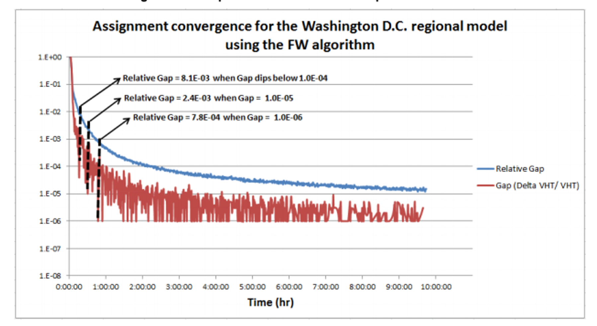
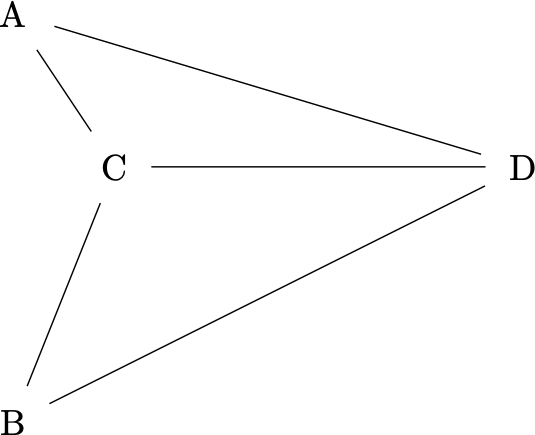

# Network Assignment and Validation {#chap-assignment}

The purpose of network assignment is to estimate the traffic flows that will 
occur on each highway link, given the highway network and the trips flowing 
from all origins to all destinations (determined by the other three 
steps of the four-step model).

On average, we start from the assumption that people will take the shortest path
available to them. The travel time on a particular road is a function of the
road's capacity as well as its volume. Because the volume is not known when we
start a traffic assignment process, we will have to find the solution iteratively.

## Volume - Delay Functions

A volume-delay function (VDF) calculates the increase of travel time on a
roadway based on the ratio of volume $V$ to capacity $C$. A popular equation in
travel modeling is a function developed by the Buruea of Public Roads (the
predecessor to the US Department of Transportation). The BPR VDF is

\begin{equation}
  t = t_0[1 + \alpha * (V/C)^\beta] 
  (\#eq:bpr-vdf)
\end{equation}

Where $t$ is the travel time on the link, $t_0$ is the base travel time, 
and $\alpha, \beta$ are calibrated parameters. Figure \@ref(fig:bpr-coeffs) 
shows average values for BPR functions obtained from a sample of MPO travel models
of different sizes. As roads become more heavily loaded, the travel time increases
and other routes become more attractive.

<div class="figure">

<p class="caption">(\#fig:bpr-coeffs)Average BPR VDF curves in a sample of MPO models.</p>
</div>


## Assignment Algorithms

Consider that we have the network below, with two routes between nodes $A$ and
$B$. The bypass is longer initially, but its travel time will grow less quickly
with added volume.


In general, the operating theory of network assignment is called 
*static user equilibrium*,

> A network is in static user equilibrium if a person cannot find a shorter path 
between their origin and destination. That is, all paths that are used have the
same travel cost, and all longer paths are unused.

In a small and simple network, we could just generate a system of equations that
represent the SUE conditions, and solve for the values that will give us that
loading. In our example, we can write the system of equations as

\begin{align*}
    &   t_b &- 0.005 V_b  &           &= 15 \\
t_t &       &             &- 0.02 V_t &= 10 \\
t_t & - t_b &             &           &= 0\\
    &       &       V_b   & + V_t     &= 1000\\
\end{align*}

We can solve this using our matrix calculation skills from linear algebra. The
SUE assignment is reached when 600 vehicles take the bypass and 400 vehicles take
the through road, because when that happens both the routes have an equal
travel time of 18 minutes.


```r
(A <- matrix(c(0, 1, -0.005, 0, 
              1, 0, 0, -0.02, 
              1, -1, 0, 0,
              0, 0, 1, 1), byrow = TRUE, ncol = 4))
```

```
##      [,1] [,2]   [,3]  [,4]
## [1,]    0    1 -0.005  0.00
## [2,]    1    0  0.000 -0.02
## [3,]    1   -1  0.000  0.00
## [4,]    0    0  1.000  1.00
```

```r
b <- c(15, 10, 0, 1000)
# Ax = b -> x = A^-1 b
solve(A) %*% b
```

```
##      [,1]
## [1,]   18
## [2,]   18
## [3,]  600
## [4,]  400
```

It is not going to be feasible to construct this UE matrix for more complex networks.
So engineers have developed heuristic algorithms that iterate to find
a solution that replicates the UE conditions.

### All-or-Nothing
The most basic way to assign trips is with an "all-or-nothing" (AON) assignment.
This simply puts all the trips between $i$ and $j$ on the shortest route. This
is obviously not great in a lot of ways, because it will overload some
roads while leaving other roads completely empty. So if we assign 1000 trips to
this network, the volumes and travel times become


We could repeat this process many times, assigning new AON loads to the updated
travel times. This won't converge to anything, but we could take the average of
all the different AON loadings and run with that. It's not perfect, but it's
easy.


### Incremental Assignment

Instead of assigning the flows all at once, we might be able to get a more
realistic loading by loading the flows in increments. Here's how this algorithm
works:

  1. Select increments $p_n$ that sum to 1 (e.g.,  0.4, 0.3, 0.2, and 0.1)
  1. Calculate the travel times on all links
  1. Assign $V_n * p_n$ trips to the network via All-or-Nothing
  1. Return to step 2 with the next increment
  
Assigning the 1000 trips to our two-route network using the increment values
results in the following successive assignments.
  
| Iteration | Increment | Vb  | tb   | Vt  | tt |
|-----------|-----------|-----|------|-----|----|
| 0         |           | 0   | 15   | 0   | 10 |
| 1         | 0.4       | 0   | 15   | 400 | 18 |
| 2         | 0.3       | 300 | 16.5 | 400 | 18 |
| 3         | 0.2       | 500 | 17.5 | 400 | 18 |
| 4         | 0.1       | 600 | 18   | 400 | 18 | 

### Successive Averages (FHWA) Assignment

A big problem with the AON assignment (and with incremental assignment) is the
large jump in travel times between iterations. It also is not guaranteed to
converge to any particular solution, and the outcome is determined by the
assumptions of the number of increments applied.

This can be improved with a method developed by FHWA that is designed to
repeatedly load the network and update the travel times by a diminishing rate.
In this method, the volume on any particular link after iteration  is given by

\begin{equation}
  V_{n} = (1-\phi) * V_{n-1} + \phi F
  (\#eq:fhwa)
\end{equation}

Where $\phi = 1 / n$ and F is the load of an All-or-Nothing assignment. 
As $n$ increases, the relative amount of weight given to the previous assignment
increases relative to the new AON assignment. The following table shows ten iterations
of this algorithm.

| Iterations | Load | phi        | Vt         | tt         | Vb         | tb         |
|------------|------|------------|------------|------------|------------|------------|
| 1          | F    | 1          | 1000       |            |            |            |
|            | V    |            | 1000       | 30         |            | 15         |
| 2          | F    | 0.5        |            |            | 1000       |            |
|            | V    |            | 500        | 20         | 500        | 17.5       |
| 3          | F    | 0.33333333 |            |            | 1000       |            |
|            | V    |            | 333.33     | 16.67      | 666.67     | 18.3333333 |
| 4          | F    | 0.25       | 1000       |            |            |            |
|            | V    |            | 500        | 20         | 500        | 17.5       |
| 5          | F    | 0.2        |            |            | 1000       |            |
|            | V    |            | 400        | 18         | 600        | 18         |
| 6          | F    | 0.16666667 | 1000       |            | 0          |            |
|            | V    |            | 500        | 20         | 500        | 17.5       |
| 7          | F    | 0.14285714 |            |            | 1000       |            |
|            | V    |            | 428.571429 | 18.5714286 | 571.428571 | 17.8571429 |
| 8          | F    | 0.125      |            | 10         | 1000       | 20         |
|            | V    |            | 375        | 17.5       | 625        | 18.125     |
| 9          | F    | 0.11111111 | 1000       |            |            |            |
|            | V    |            | 444.44     | 18.89      | 555.56     | 17.78      |
| 10         | F    | 0.1        |            |            | 1000       |            |
|            | V    |            | 400.00     | 18.00      | 600.00     | 18.00      |

### Frank-Wolfe 

We can represent SUE traffic assignment as a nonlinear optimization problem. Let

  - $v_a =$ vehicles assigned to link $a$.
  - $S_a(v_a) =$ the travel cost on link $a$ as a function of its volume (VDF function)
  - $X_{ij}^r =$ the total number of vehicles traveling from $i$ to $j$ on
  the sum of links that represent route $r$.
  
We want to minimize the total travel cost

\begin{equation}
  \sum_a \int_0^{v_a} S_a(x) dx
  (\#eq:fw-objective)
\end{equation}

subject to the constraints

\begin{align*}
  v_a &= \sum_i \sum_j \sum_r \delta_{ij}^{ar}X_{ij}{r}\\
  \sum_r X_{ij}^r &= T_{ij}\\
  X_{ij}^r &\geq 0 
\end{align*}  
 
In text, the constraints are as follow: the volume on a link is a
sum of the volume on all routes that use that link ($\delta$ is indicator), the 
total of all routes has to equal the total number of trips assigned, and the
paths on a route are not allowed to be negative.

Various algorithms can be used to find the values of $v_a$ that minimize this
objective function subject to these constraints. A popular algorithm is the 
Frank-Wolfe algorithm, though other algorithms have been developed that converge 
more quickly under different scenarios.

With these algorithms, it is essential to allow the algorithm to converge
appropriately. A measure of the convergence is a statistic called the "relative
gap", or the difference between the assignment at that iteration and an AON
assignment made with the calculated travel times. As this gap becomes smaller,
it means that the difference between travel times on the routes are becoming
closer to each other. The figure below shows the value of the relative gap 
after several thousand iterations in the Washington, D.C. travel model.

<div class="figure">

<p class="caption">(\#fig:relative-gap)Relative gap after several thousand iterations.</p>
</div>

Large networks may take many hours to reach convergence that is acceptable for
policy analysis. There is a large incentive to "cut corners" by shrinking the
maximum number of iterations that are run, but this can lead to strange behavior.

## Homework {-#hw-assignment}




The figure above^[This is an adaptation of a homework assignment from
Dr.\ John Ivan at the University of Connecticut.] represents a simple four-node
network where 7000 vehicles travel from A to D, and 5000 travel from B to D
(there are no additional trips from C to D). Link travel times for the network
are given by the functions below.

\begin{align*}
t_{AD} =& 20 + 0.01 q_{AD}\\
t_{AC} =& 10 + 0.005 q_{AC}\\
t_{CD} =& 12 + 0.005 q_{CD}\\
t_{BC} =& 7.25 + 0.005 q_{BC}\\
t_{BD} =& 20 + 0.01 q_{BD}
\end{align*}

Question 1: Solve for the user equilibrium (UE) link flows and travel times by
solving a set of simultaneous equations that explicitly define the UE
conditions.  Demonstrate that your solution is the user equilibrium by showing
through example that all UE conditions are satisfied.

Question 2: Perform four iterations of All Or Nothing (AON) assignment on the network
and O/D volumes.  Show the link flows and travel times at the end of each
iteration and compute the average link loads and travel times.

Question 3: Perform four iterations of an incremental assignment assignment 
using the increment values 0.4, 0.3, 0.2, and 0.1.  Show the link flows and
travel times at the end of each iteration.

Question 4: Assign trips using the successive averages (FHWA) heuristic.  Show
the link flows and travel times for five successive assignments, and the final
assignment. 

Question 5: Compare these three traffic assignment heuristic approaches to the UE
assignment and to each other.  How do the resulting flow patterns differ (cite
specific differences)?  Which one comes closest to the UE flows? 

Question 5: You are considering a road widening project in a suburb of a large
metropolitan area (indicated with the blue circle). The difference in loaded
volumes between your base scenario (no-build) and the widening is given in the figure
below. What is a likely explanation for the patterns shown in the figure?

<div class="figure">

<p class="caption">(\#fig:unnamed-chunk-3)Difference in assigned volumes when adding a lane in area with blue circle.</p>
</div>


## Laboratory Assignment {-}

The highway volume-to-capacity curves in the Roanoke Model have already been
largely calibrated^[To be specific, VDOT has values that they assert for all of
their models]. They use the Bureau of Public Roads (BPR) format,

$$T_c = T_0 * (1 + \alpha (V / C)^\beta)$$
Create a plot showing the values of these curves for varying VOC ratios and 
discuss the implications of the different curves on different facility types in
your report. Note that there are 5 facility types in the BPR table but 11
facility types in the model network. The assignment script files have comments
that build a crosswalk between the two facility type definitions.

For this lab, you will create a model validation report where you 
examine the following:

  - Root mean squared error (RMSE) by facility type, area type, volume group,
  and by screenline. Are there certain classes that are outperforming others? 
  - Observed vs Modeled link volume scatterplots: an X-Y fit
  line by facility type as well as a maximum desirable deviation plot defined in
  NCHRP 765.
  - Geographic distribution of link error. 
  
Comment on the Roanoke model's calibration.
